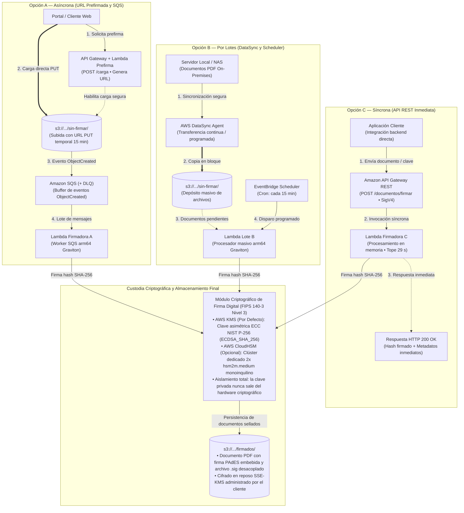
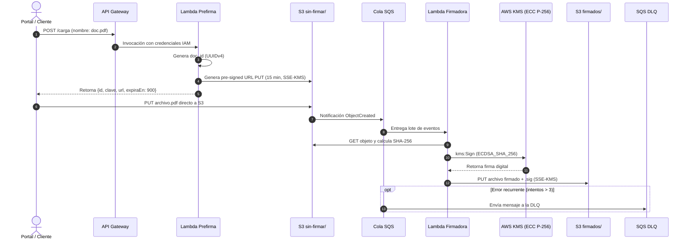
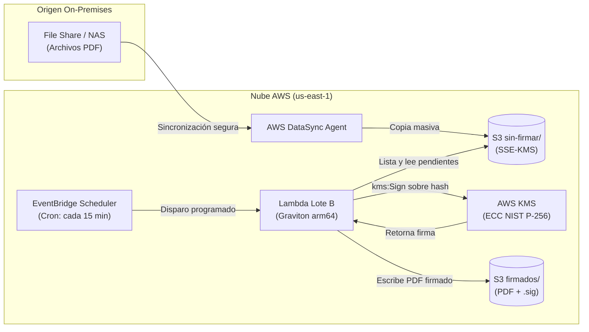
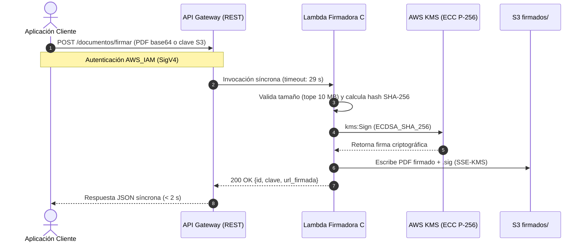

# Infraestructura como Código (IaC) — Firma Digital de Documentos en AWS

**Autor:** Marlon E. Figueroa  
**Plataforma:** Amazon Web Services (AWS)  
**Herramienta IaC:** AWS CloudFormation (Plantillas anidadas)  
**Región Base:** `us-east-1`  

---

## 1. Descripción General

Este repositorio contiene la arquitectura empresarial e Infraestructura como Código (IaC) para la **firma digital de documentos PDF** en AWS. 

El sistema implementa un modelo de almacenamiento centralizado en Amazon S3 dividido en prefijos operativos (`sin-firmar/` y `firmados/`) y proporciona tres canales de ingesta y procesamiento complementarios:
1. **Opción A (Asíncrona por eventos con SQS):** Carga directa mediante URL prefirmada y desacople con cola SQS y DLQ.
2. **Opción B (Por lotes con DataSync y EventBridge):** Ingesta masiva desde almacenamiento local/NAS y procesamiento por lotes cada 15 minutos.
3. **Opción C (Síncrona en tiempo real):** Endpoint REST en API Gateway para firma inmediata en la misma llamada (tope 29 segundos).

Todas las opciones contemplan aislamiento criptográfico estricto mediante claves KMS administradas por el cliente (CMK), arquitectura de cómputo en ARM64 (AWS Graviton) y la capacidad de alternar entre firma de alta eficiencia con **AWS KMS** y hardware criptográfico dedicado con **AWS CloudHSM**.

---

## 2. Vías de Procesamiento y Opciones de Arquitectura



### Opción A — Carga por URL Prefirmada y Cola SQS (Asíncrona)
* **Ingesta:** El cliente solicita una URL de subida temporal mediante `POST /carga` en API Gateway. La función Lambda de prefirma genera una URL prefirmada de `PUT` en S3 con validez de 15 minutos, forzando cifrado SSE-KMS.
* **Desacople:** Al completarse la carga en `sin-firmar/{id}.pdf`, una notificación de eventos de S3 encola el trabajo en **Amazon SQS**.
* **Procesamiento:** La Lambda firmadora consume los mensajes en lotes de hasta 10 documentos, calcula el hash SHA-256 del archivo, solicita la firma a AWS KMS o CloudHSM, y deposita el archivo en `firmados/{id}.pdf` junto a su firma criptográfica.
* **Resiliencia:** Si ocurre un error, el mensaje cuenta con 3 intentos (`maxReceiveCount: 3`) antes de ser enviado a una Dead Letter Queue (**SQS DLQ**).



### Opción B — Depósito por DataSync y Procesamiento por Lote (Batch)
* **Ingesta:** Diseñada para entornos empresariales donde los documentos se originan en servidores de archivos locales, NAS o almacenamiento on-premises. Un agente de **AWS DataSync** sincroniza los archivos hacia el prefijo `sin-firmar/`.
* **Disparador:** **Amazon EventBridge Scheduler** ejecuta una Lambda de procesamiento por lote cada 15 minutos.
* **Procesamiento:** La Lambda itera los documentos acumulados, firma cada uno de ellos y los mueve al prefijo `firmados/`. Aquellos que no alcancen a procesarse dentro de la ventana de ejecución continúan en el siguiente ciclo.



### Opción C — Endpoint REST Síncrono (Tiempo Real)
* **Ingesta y Ejecución:** Expone el endpoint `POST /documentos/firmar` protegido con autorización `AWS_IAM` en Amazon API Gateway.
* **Flujo:** Admite la carga directa del binario PDF (hasta 10 MB) en base64 o la referencia a un objeto existente en S3. La Lambda ejecuta la firma y responde en la misma conexión HTTP con la confirmación y la clave del archivo firmado. La llamada se mantiene dentro del límite de 29 segundos de API Gateway.



---

## 3. Modelo Criptográfico y Seguridad

### Aislamiento de Claves (Customer Managed Keys - CMK)
Siguiendo el principio de menor privilegio y separación de funciones ([NIST SP 800-57](https://csrc.nist.gov/publications/detail/sp/800-57-part-1/rev-5/final)):
1. **Llave de Firma Digital (Asimétrica):** Clave ECC NIST P-256 (`KeySpec: ECC_NIST_P256`, `KeyUsage: SIGN_VERIFY`). Se emplea exclusivamente para operaciones `kms:Sign` sobre el hash `SHA-256` del documento.
2. **Llave de Cifrado de Bucket S3 (Simétrica):** Clave AES-256 (`KeySpec: SYMMETRIC_DEFAULT`, `KeyUsage: ENCRYPT_DECRYPT`). Cifra todos los objetos en reposo mediante SSE-KMS. Las políticas del bucket rechazan cualquier subida en texto claro o con SSE-S3 (`aws:kms` obligatorio).
3. **Llave de Colas SQS (Simétrica):** Cifra los mensajes en tránsito y en reposo de la cola de trabajo y la cola DLQ.
4. **Llave de CloudWatch Logs (Simétrica):** Cifra los grupos de registros de auditoría y ejecución de las funciones Lambda.

```mermaid
flowchart TD
    subgraph KMS_CMK["Claves Administradas por el Cliente (KMS CMK)"]
        direction TB
        KMS_SIGN["KMS Llave de Firma<br/>• Asimétrica (ECC_NIST_P256)<br/>• Uso: SIGN_VERIFY<br/>• Custodia de clave privada"]
        KMS_S3["KMS Llave Bucket S3<br/>• Simétrica (AES-256-GCM)<br/>• Uso: ENCRYPT_DECRYPT<br/>• Rotación anual de clave"]
        KMS_SQS["KMS Llave Colas SQS<br/>• Simétrica (AES-256-GCM)<br/>• Uso: ENCRYPT_DECRYPT<br/>• Reutilización Data Key: 5m"]
        KMS_LOGS["KMS Llave CloudWatch Logs<br/>• Simétrica (AES-256-GCM)<br/>• Uso: ENCRYPT_DECRYPT<br/>• Cifrado de auditoría"]
    end

    subgraph RECURSOS["Servicios y Componentes Protegidos"]
        LAMBDA["Lambdas Firmadoras<br/>(Calculan SHA-256 y firman)"]
        S3["Bucket S3<br/>(sin-firmar/ y firmados/)"]
        SQS["Colas SQS<br/>(Trabajo y DLQ)"]
        LOGS["Grupos de Registros<br/>(CloudWatch Logs)"]
    end

    LAMBDA -->|kms:Sign (ECDSA_SHA_256)| KMS_SIGN
    S3 -->|SSE-KMS GenerateDataKey| KMS_S3
    SQS -->|Cifrado en reposo y tránsito| KMS_SQS
    LOGS -->|Cifrado de eventos de log| KMS_LOGS
```

### Estándar de Firma (CMS / PAdES)
La firma electrónica avanzada se genera siguiendo el estándar **CMS (Cryptographic Message Syntax)** y el perfil **PAdES (PDF Advanced Electronic Signatures)**:
* La función Lambda extrae el resumen criptográfico del PDF (`SHA-256`).
* Se firma el digest utilizando el algoritmo `ECDSA_SHA_256` con la clave privada custodiada en el HSM (KMS o CloudHSM).
* La clave privada **nunca sale del hardware criptográfico sin cifrar**. La firma resultante se empaqueta en una estructura PKCS#7 / CMS incrustada o desacoplada (`.sig`).

---

## 4. Decisión Arquitectónica: AWS KMS vs. CloudHSM («Modo Apagado»)

### ¿Por qué CloudHSM permanece «apagado» por defecto?
En **AWS CloudHSM no existe un comando de suspensión o pausa temporal** (como el *Stop* de una instancia EC2). Un módulo HSM aprovisionado es una tarjeta PCIe física dedicada monoinquilino que AWS factura ininterrumpidamente a **$1.60 USD/hora por HSM**:
$$\text{Costo base Clúster HA (2 HSM)} = 2 \times \$1.60 \times 730\text{ h} \approx \$2,336\text{ USD/mes}$$

```mermaid
flowchart TD
    Start{"¿Normativa exige hardware monoinquilino<br/>dedicado FIPS 140-3 Nivel 3?"}

    Start -->|No (Recomendado)| ModeKMS["DeployCloudHsm = 'false'<br/>(CloudHSM Apagado)"]
    Start -->|Sí (Banca / Auditoría Especial)| ModeHSM["DeployCloudHsm = 'true'<br/>(CloudHSM Encendido)"]

    subgraph ARCH_KMS["Arquitectura con AWS KMS"]
        direction TB
        K1["Hardware: 0 HSM aprovisionados ($0.00/mes)"]
        K2["Red: Lambdas fuera de VPC (sin VPC Endpoints)"]
        K3["Firma: kms:Sign con ECC NIST P-256"]
        K4["Costo Total: ~$10.63 USD/mes (10k docs)"]
    end

    subgraph ARCH_HSM["Arquitectura con AWS CloudHSM"]
        direction TB
        H1["Hardware: 2x HSM hsm2m.medium en 2 AZs ($2,336/mes)"]
        H2["Red: Lambdas dentro de VPC + 2 VPC Endpoints ($29.20/mes)"]
        H3["Firma: Cliente PKCS#11 / JCE contra IP privada de HSM"]
        H4["Costo Total: ~$2,375.61 USD/mes (10k docs)"]
    end

    ModeKMS ==> ARCH_KMS
    ModeHSM ==> ARCH_HSM
```

En este proyecto, el parámetro de CloudFormation:
```yaml
DeployCloudHsm: "false"  # Valor predeterminado
```
establece el modo **«CloudHSM apagado»**, lo que significa:
* **Cero recursos de hardware dedicados desplegados:** No se crea el recurso `AWS::CloudHSMV2::Cluster` ni los HSMs, reduciendo el costo fijo a **$0.00 USD/mes**.
* **Lambdas sin sobrecarga de VPC:** Al no requerir conectarse a una IP privada de HSM, las funciones Lambda corren fuera de la VPC privada, eliminando la necesidad de desplegar VPC Interface Endpoints ($29.20 USD/mes adicionales).
* **Firma delegada en AWS KMS:** La firma digital opera al 100% mediante AWS KMS, cuyos HSMs multi-inquilino cuentan con certificación **FIPS 140-3 Nivel 3**.

### Comparativa de Costos (a 10.000 documentos/mes)

| Rubro | Con AWS KMS (CloudHSM «Apagado») | Con AWS CloudHSM (Clúster Dedicado Activo) |
| :--- | :--- | :--- |
| **Custodia de Llave / Hardware** | **$1.00/mes** (llave asimétrica) | **$2,336.00/mes** (2 HSMs `hsm2m.medium`) |
| **Firmas Digitales (10k firmas)** | **$0.15/mes** ($0.15 por 10.000) | **$0.00/mes** (incluido en el cómputo de la tarjeta) |
| **VPC Endpoints (SQS, Logs)** | **$0.00/mes** (sin VPC para Lambda) | **$29.20/mes** (2 endpoints x 2 AZs) |
| **Llaves de Almacén (S3, SQS, Logs)** | $3.00 - $4.00/mes | $2.00 - $3.00/mes |
| **Cómputo Lambda + S3 + API Gateway** | ~$6.33/mes | ~$7.27/mes (mayor RAM/tiempo en VPC) |
| **Total Mensual Estimado** | **~$10.63 USD** | **~$2,375.61 USD** |

> **Nota técnica:** Un *Custom Key Store* de AWS KMS respaldado por CloudHSM **no admite claves asimétricas de firma** (únicamente claves simétricas AES para cifrado). Por lo tanto, usar CloudHSM para firma de PDF exige que la aplicación se conecte directamente al clúster mediante bibliotecas **PKCS#11** o proveedores **JCE**, justificando el requerimiento de red VPC privada.

### Activación de CloudHSM (`DeployCloudHsm: "true"`)
Si auditorías externas o normativas financieras exigen hardware dedicado monoinquilino:
1. Se cambia el parámetro a `DeployCloudHsm: "true"`.
2. CloudFormation aprovisiona 2 HSMs `hsm2m.medium` en distintas zonas de disponibilidad.
3. Se activa `VpcConfig` en las Lambdas para enlazar sus ENIs a las subredes privadas.
4. Se configuran VPC Endpoints privados para que las Lambdas dentro de la VPC privada alcancen S3, SQS y CloudWatch Logs sin necesidad de NAT Gateway.

---

## 5. Estructura del Repositorio

```text
iac_firma_digital/
├── README.md                           # Documentación principal del repositorio
├── context/
│   └── compartido.yaml                 # Convenciones y restricciones arquitectónicas
├── opcion_a/                           # Despliegue Opción A (Prefirmada + SQS)
│   ├── template_main.yaml              # Stack raíz de CloudFormation
│   ├── vars.yaml                       # Parámetros de despliegue
│   ├── vpc/                            # Subredes y VPC Endpoints (condicional HSM)
│   ├── kms/                            # Claves CMK simétricas y asimétricas
│   ├── s3/                             # Bucket con lifecycle y directivas de cifrado
│   ├── sqs/                            # Cola de mensajes y Dead Letter Queue (DLQ)
│   ├── iam/                            # Roles de ejecución con permisos mínimos
│   ├── lambda/                         # Lambdas en Python 3.12 (arm64 Graviton)
│   ├── apigateway/                     # API Gateway REST con autenticación IAM
│   └── cloudhsm/                       # Stack condicional para clúster CloudHSM
├── opcion_b/                           # Despliegue Opción B (DataSync + Scheduler)
│   ├── template_main.yaml
│   └── ... (plantillas modulares)
├── opcion_c/                           # Despliegue Opción C (API REST Síncrona)
│   ├── template_main.yaml
│   └── ... (plantillas modulares)
└── docs/
    └── arquitectura/                   # Documentación ejecutiva, diagramas y especificaciones
        ├── propuesta-procesamiento-costos.pdf  # Propuesta y desglose de costos (PDF)
        ├── propuesta-procesamiento-costos.md   # Fuente técnica Markdown de costos
        ├── firma-digital.drawio                # Diagrama integral de arquitectura
        ├── firma-digital.drawio.pdf            # Exportación vectorial del diagrama
        ├── opcion-a.html                       # Diagrama interactivo SVG de Opción A
        ├── opcion-b.html                       # Diagrama interactivo SVG de Opción B
        └── opcion-c.html                       # Diagrama interactivo SVG de Opción C
```

---

## 6. Despliegue con AWS CloudFormation

### Prerrequisitos
* Cuenta de AWS con permisos administrativos sobre IAM, KMS, S3, Lambda, SQS, API Gateway y VPC.
* AWS CLI configurado (`aws configure`).
* Un bucket S3 para alojar las plantillas secundarias anidadas de CloudFormation.

### Pasos de Despliegue

1. **Publicar las plantillas en un bucket de artefactos:**
   ```bash
   # Crear bucket si no existe
   aws s3 mb s3://mi-bucket-templates-firma --region us-east-1

   # Sincronizar los archivos de la opción deseada (ejemplo: opcion_a)
   aws s3 sync ./opcion_a/ s3://mi-bucket-templates-firma/opcion_a/
   ```

2. **Desplegar el Stack Principal con CloudHSM «apagado» (Recomendado):**
   ```bash
   aws cloudformation create-stack \
     --stack-name firma-digital-opcion-a \
     --template-url https://mi-bucket-templates-firma.s3.amazonaws.com/opcion_a/template_main.yaml \
     --parameters \
         ParameterKey=TemplatesBaseUrl,ParameterValue=https://mi-bucket-templates-firma.s3.amazonaws.com/opcion_a \
         ParameterKey=ProjectName,ParameterValue=firma-digital \
         ParameterKey=Environment,ParameterValue=dev \
         ParameterKey=DeployCloudHsm,ParameterValue=false \
     --capabilities CAPABILITY_IAM CAPABILITY_NAMED_IAM \
     --region us-east-1
   ```

3. **Desplegar con CloudHSM «encendido» (Solo si se requiere HSM dedicado):**
   ```bash
   aws cloudformation update-stack \
     --stack-name firma-digital-opcion-a \
     --template-url https://mi-bucket-templates-firma.s3.amazonaws.com/opcion_a/template_main.yaml \
     --parameters \
         ParameterKey=TemplatesBaseUrl,ParameterValue=https://mi-bucket-templates-firma.s3.amazonaws.com/opcion_a \
         ParameterKey=DeployCloudHsm,ParameterValue=true \
     --capabilities CAPABILITY_IAM CAPABILITY_NAMED_IAM \
     --region us-east-1
   ```

---

## 7. Referencias Técnicas y Estándares

El diseño criptográfico, la selección de parámetros de claves y la estrategia de custodia de este proyecto se fundamentan en las siguientes especificaciones y guías oficiales de la industria:

1. [Referencia de especificaciones de clave en AWS KMS](https://docs.aws.amazon.com/es_es/kms/latest/developerguide/symm-asymm-choose-key-spec.html)  
   Documentación oficial de AWS KMS que detalla las especificaciones de claves criptográficas (`KeySpec`). Fundamenta la elección de `ECC_NIST_P256` para firmas digitales `ECDSA_SHA_256` con separación de roles (`SIGN_VERIFY`), frente a `SYMMETRIC_DEFAULT` (AES-256-GCM) para cifrado de datos en reposo (`ENCRYPT_DECRYPT`).

2. [RFC 5753 — Use of Elliptic Curve Cryptography (ECC) Algorithms in Cryptographic Message Syntax (CMS)](https://datatracker.ietf.org/doc/html/rfc5753/)  
   Estándar de la Internet Engineering Task Force (IETF) que define el uso de curvas elípticas (incluyendo curvas NIST como P-256 / secp256r1) dentro de las estructuras de firma CMS/PKCS#7, base del estándar internacional de firma electrónica PAdES para documentos PDF.

3. [Aspectos esenciales de la criptografía en AWS KMS](https://docs.aws.amazon.com/es_es/kms/latest/developerguide/kms-cryptography.html)  
   Guía técnica de arquitectura de seguridad de AWS KMS. Describe la certificación FIPS 140-3 Nivel 3 de los módulos HSM de KMS, los generadores de entropía y números aleatorios (NIST SP 800-90A CTR_DRBG), el cifrado de sobres (*envelope encryption*) y la garantía de que las claves privadas nunca abandonan los HSM sin cifrar.

4. [Cómo migrar claves asimétricas desde CloudHSM a AWS KMS (AWS Security Blog)](https://aws.amazon.com/es/blogs/security/how-to-migrate-asymmetric-keys-from-cloudhsm-to-aws-kms/)  
   Artículo técnico oficial que describe la importación de material de claves asimétricas externas (`--origin EXTERNAL`) desde clústeres de AWS CloudHSM o entornos on-premises hacia AWS KMS mediante llaves de envoltura (*wrapping keys* RSA-4096 / RSAES_OAEP_SHA_256). Proporciona el marco operativo para consolidar la custodia en KMS sin perder certificados existentes y respaldando la transición desde CloudHSM hacia arquitecturas sin servidor de bajo costo.
